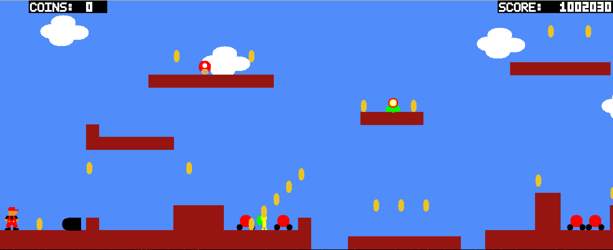

## OCamlMario
A mario-like single player side-scrolling game engine built with OCaml. Player can create and load their own JSON level files. 

Supported enemies:
- Goombas
- Bullet Bills
- Koopas

## How-To
To play the game, use the "A" and "D" keys to move left and right, respectively. Use "left click" to jump. Avoid Bullet Bills and try to eliminate Goombas and Koopas. Collect power-ups such as Fire Mario and Super Mario to enhance your abilities. Collect coins and complete the level as a fast as you can. Good luck!

## Demonstration

